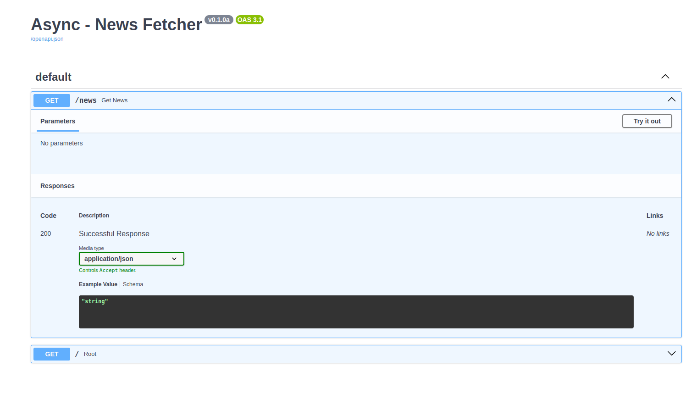
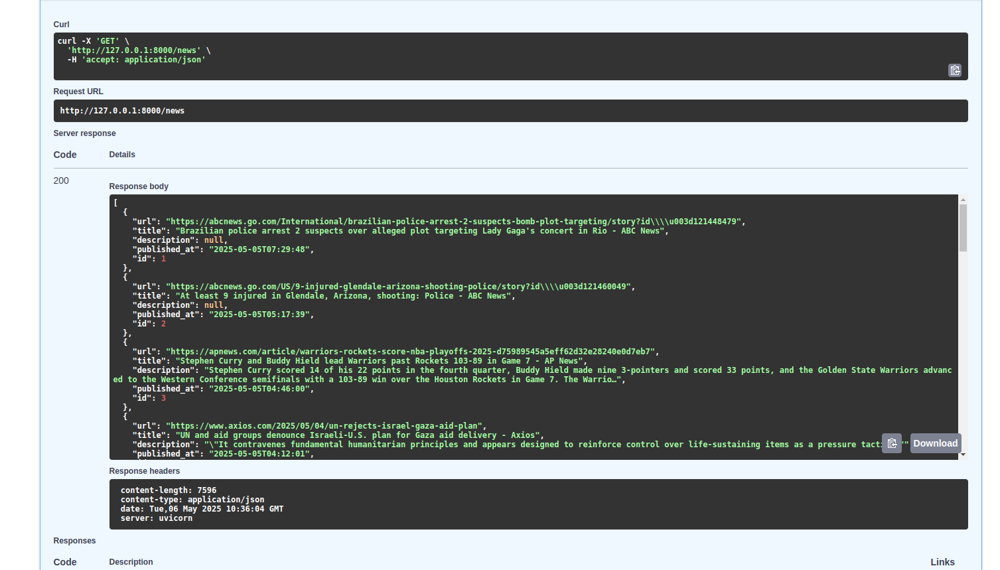
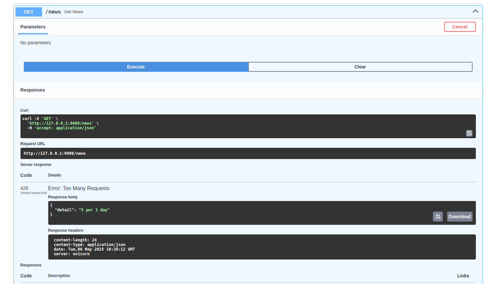
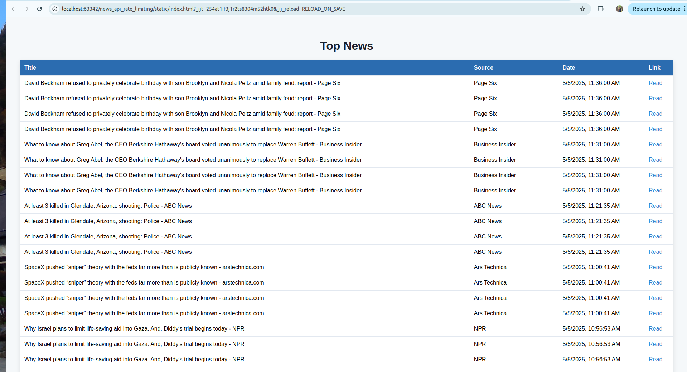

# news_api_rate_limiting
This project focuses on implementation of News API Rate limiting usigng FastAPI, Asyncio, SQLModel

##  Project Summary: Async News Fetcher with Rate Limiting

### Features:

- Fetch 20 news articles from NewsAPI.org (external API) and store them into PostgreSQL.

- Serve local news data via FastAPI, with a rate limit of 5 fetches per day per IP.

### Tech Stack:

| Component                  | Tool                                        |
| -------------------------- | ------------------------------------------- |
| API server                 | FastAPI                                     |
| Async support              | `httpx`, `
`, `asyncio`               |
| Database                   | PostgreSQL (accessed via `asyncpg`)         |
| ORM (optional but helpful) | `SQLModel` or `SQLAlchemy` (async mode)     |
| Rate Limiting              | `slowapi` (Flask-style limiter for FastAPI) |
| Environment variables      | `python-dotenv`                             |

### Run
uvicorn app.main:app --reload

### Testing
curl http://localhost:8000/news

### Future Improvements
Add user registration/auth with rate limit per user instead of IP

Store full request logs and timestamps

Add endpoint to trigger news fetch manually (POST /fetch-news)

Add pagination or search filters

### Output snaps

